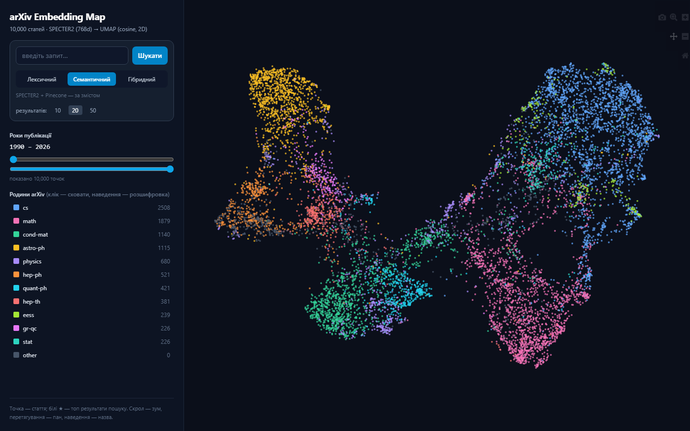
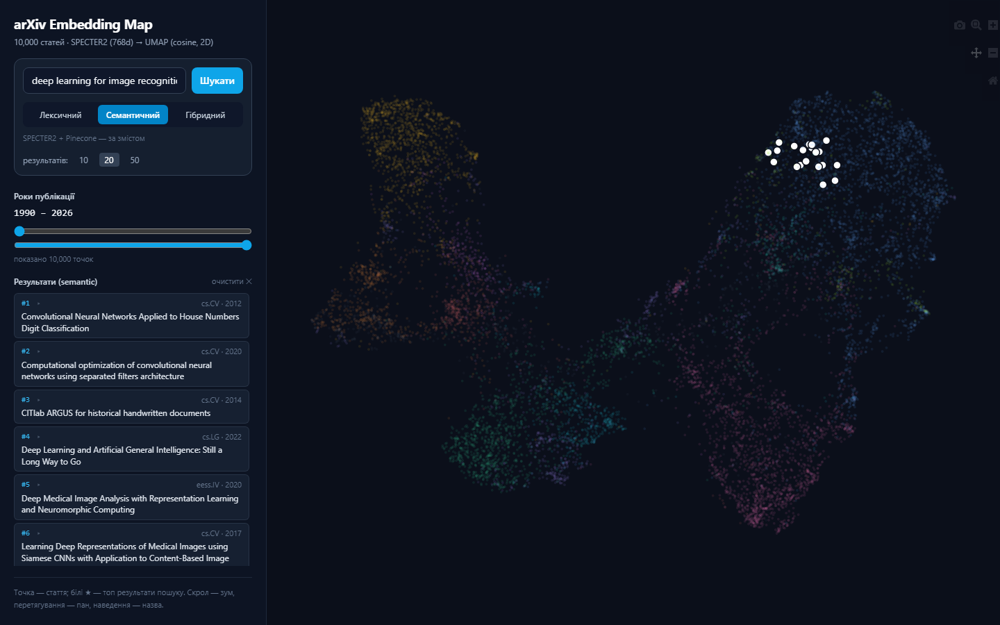
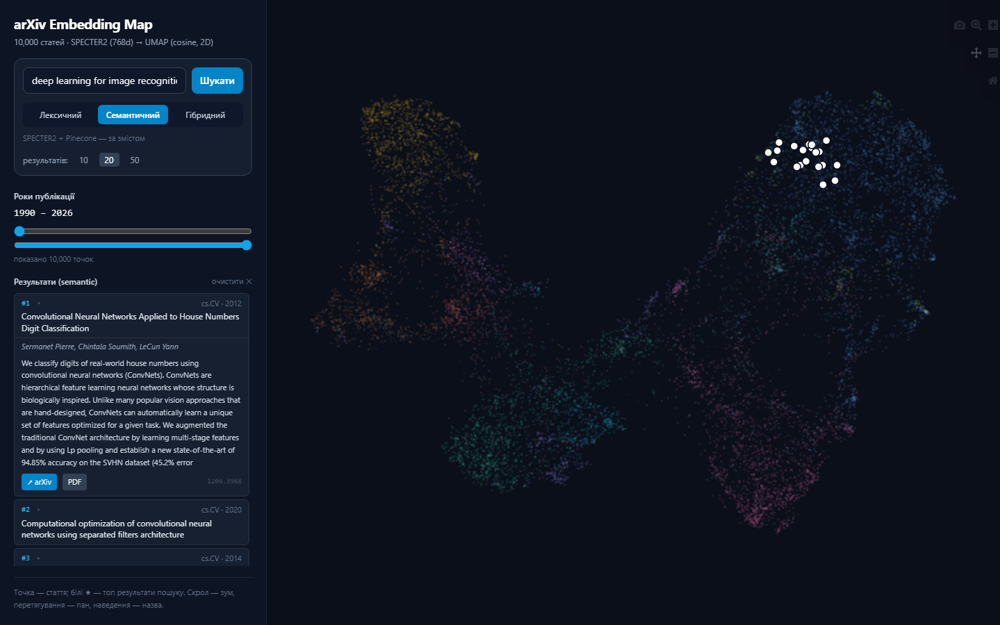

# NoSQL · Домашнє завдання 2 — Векторний пошук над науковими статтями arXiv

Семантичний, фільтрований та гібридний пошук по 10 000 наукових статтях arXiv із
використанням **Pinecone** (векторна БД), моделі ембедингів **`allenai/specter2_base`**,
**BM25** та **Reciprocal Rank Fusion**.

- **Репозиторій:** https://github.com/drdangr/zolotarenko_nosql_2
- **Стек:** Python 3.12, sentence-transformers, Pinecone (serverless), rank-bm25, pandas, PyTorch (CUDA).

---

## Структура проєкту

```
zolotarenko_nosql_2/
├── scripts/
│   ├── 01_prepare_data.py      # підготовка підмножини arXiv → Parquet
│   ├── 02_embed.py             # ембединги SPECTER2 (title [SEP] abstract)
│   ├── 03_load_to_pinecone.py  # створення індексу + батчева загрузка
│   ├── 04_search.py            # семантичний / фільтрований пошук + порівняння метрик
│   ├── 05_chunking.py          # fixed-size vs semantic chunking
│   └── 06_hybrid_search.py     # BM25 + вектор + RRF
├── data/            # arxiv_subset.parquet (у .gitignore)
├── embeddings/      # embeddings.npy (у .gitignore)
├── docs/            # завдання + збережений вивід скриптів
├── requirements.txt
├── .env.example     # шаблон для PINECONE_API_KEY (.env у .gitignore)
└── README.md
```

## Розгортання з нуля

### Передумови
- **Python 3.10+** (тестовано на 3.12).
- **~7 ГБ вільного місця** (датасет: ~1.2 ГБ архів + ~5.3 ГБ розпакований JSONL).
- **GPU з CUDA** бажано (ембединги 10k рахуються за хвилину), але працює і на CPU
  (повільніше) — код сам обирає пристрій (`cuda` ↔ `cpu`).
- Безкоштовний акаунт **Pinecone** (тариф Starter) і акаунт **Kaggle**.

### 1. Залежності
```bash
pip install -r requirements.txt
```
> `torch` ставиться як залежність `sentence-transformers` (за замовчуванням CPU-версія).
> Для GPU спершу встанови torch під свою CUDA з https://pytorch.org, а тоді решту.

### 2. Ключ Pinecone
Зареєструйся на https://pinecone.io → розділ **API Keys** → **Create key**. Потім:
```bash
cp .env.example .env      # і впиши свій ключ у PINECONE_API_KEY
```

### 3. Датасет (Kaggle)
1. Створи API-токен: https://www.kaggle.com → **Settings → API → Create New Token**
   (завантажиться `kaggle.json`).
2. Поклади його у `~/.kaggle/kaggle.json` (Windows: `C:\Users\<ім'я>\.kaggle\kaggle.json`).
3. Завантаж і розпакуй так, щоб JSON опинився саме в теці `data/`:
```bash
kaggle datasets download -d Cornell-University/arxiv
unzip arxiv.zip -d data/        # → data/arxiv-metadata-oai-snapshot.json (~5.3 ГБ)
```

### 4. Основний пайплайн (запускати послідовно)
```bash
python scripts/01_prepare_data.py     # → data/arxiv_subset.parquet
python scripts/02_embed.py            # → embeddings/embeddings.npy
python scripts/03_load_to_pinecone.py # створює індекс arxiv-papers і завантажує вектори
python scripts/04_search.py
python scripts/05_chunking.py         # створює індекси arxiv-chunks-*
python scripts/06_hybrid_search.py
```

### 5. Бонус — інтерактивний UI (потребує кроків 1–3)
```bash
python scripts/07_export_map.py       # → ui/map_data.js (уже в репозиторії, крок можна пропустити)
python app.py                         # Flask: UI + пошук на http://localhost:5000
```
> Карта відкривається одразу (`ui/map_data.js` закомічено), але **пошук** потребує заповненого
> індексу Pinecone — тобто спершу мають відпрацювати кроки 1–3.

### Усе одразу (раннер)
Замість послідовного запуску скриптів вручну — одна команда:
```bash
python run_pipeline.py            # кроки 01–06 по черзі (спиняється за першої ж помилки)
python run_pipeline.py --with-map # + крок 07 (карта)
python run_pipeline.py --from 4   # почати з кроку 04 (не переробляти ембединги)
python run_pipeline.py --dry-run  # лише показати план
```
Для зручності є й обгортки: **Windows** — `run.bat` (напр. `run.bat --with-map`),
**macOS/Linux** — `./run.sh`. Раннер робить preflight-перевірку (наявність датасету та `.env`)
перед запуском.

> **Примітка про відбір даних.** Дамп arXiv відсортований за датою (старі статті 2007 р. —
> на початку файлу). Щоб фільтри за роком у Частині 3 були змістовними, `01_prepare_data.py`
> робить **рівномірну вибірку (reservoir sampling) по всьому датасету** з фіксованим сидом,
> а не бере перші 10 000 рядків. Це дає зріз статей за всі роки (1990–2026).

---

# Частина 1 — Підготовка даних і вибір інструментів

## 1.1. Pinecone vs Qdrant vs Chroma

Три рішення зручно порівняти за трьома осями: **модель розгортання**, **ліцензія** та
**продуктивність**.

**Модель розгортання.** **Pinecone** — це повністю керований SaaS: власного сервера немає,
робота йде через API в їхній хмарі. Це зручно, коли треба швидко отримати готовий сервіс і
не думати про інфраструктуру. **Qdrant** — open-source, який можна розгорнути як локально
(Docker/Kubernetes), так і в їхній хмарі: на потужній робочій машині я розгорнув би його
локально, на ноутбуці — спробував би їхню хмару. **Chroma** живе вбудовано (embedded),
прямо в Python-процесі застосунку; серверний режим теж є, але «рідний» сценарій — локальний.

**Ліцензія.** Pinecone — пропрієтарне, закрите рішення. Qdrant і Chroma — open-source
(Apache 2.0). З цього випливає принциповий момент щодо **конфіденційності**: керовані
ентерпрайз-опції Pinecone (приватні окружения, сертифікації) знижують ризик, але **не
скасовують самого факту**, що дані фізично обробляються на чужій інфраструктурі. Існують
класи задач, де вимога — **дані не покидають периметр за жодних умов** (OSINT, розвідка/
контррозвідка, чутлива бізнес-аналітика, державна таємниця). Там, коли в гру вступають
держтаємниця чи серйозний бізнес, із цим не жартують — і будь-який managed-SaaS
дискваліфікується в принципі, незалежно від гарантій на папері. Лишається тільки
self-hosted (Qdrant/Chroma на власному залізі).

**Продуктивність.** «Швидко» — це не одне число; його варто розкласти на три поняття:
*латентність* одного запиту, *пропускну здатність* (QPS під навантаженням) і *масштаб*
(скільки векторів вміщується і як деградує recall@k). Chroma — найлегша: чудова для
прототипів і невеликих корпусів, але не для розподіленого продакшну з мільйонами векторів
і високою конкурентністю. Qdrant написаний на Rust (HNSW), дає чудову латентність і
**теж тягне мільйони** векторів — просто шардинг, реплікацію та експлуатацію береш на себе.
Pinecone масштабується автоматично на їхній інфраструктурі (serverless) — потужно «з
коробки», але платно і з vendor lock-in. Корисний штрих для нашого ДЗ: **гібридний пошук
із коробки** (фільтри за метаданими, а в Qdrant — і вбудований sparse/BM25) є саме в Qdrant
і Pinecone, що прямо релевантно Частині 5.

**Коли що обирати:**

| Сценарій | Вибір |
|----------|-------|
| Прототип / локальний RAG / немає інфраструктури | **Chroma** |
| Потрібен контроль, конфіденційність, власне залізо, відсутність lock-in (від середнього до великого масштабу) | **Qdrant** |
| Стартап без DevOps / не хочу думати про інфру / швидко в продакшн і готовий платити | **Pinecone** |

## 1.2. Чому `specter2_base`, а не `all-MiniLM-L6-v2`?

Ключ до відповіді — у тому, **на чому навчалася модель**. Універсальна легка
`all-MiniLM-L6-v2` тренована приблизно на 1 млрд **загальних** пар речень (парафрази,
QA тощо), розмірність 384 — вона добре ловить «побутове» семантичне сходство, але не знає
специфіки наукового тексту з його перехресними посиланнями та цитуваннями і може видавати
хибну схожість. Натомість `allenai/specter2_base` навчена саме на цьому матеріалі — на
**триплетах цитувань**, тобто сам ембединг-простір побудований так, що тематично та
цитатно пов'язані статті опиняються поряд. Це буквально і є наша задача — «знайти близькі
наукові роботи», тому спеціалізована модель розрізняє наукові тексти краще за універсальну.
Приємні штрихи: рекомендований карткою формат входу `title [SEP] abstract` — рівно той, що
ми використовуємо, а розмірність 768 дає більшу ємність за 384 у MiniLM.

Цитати з картки моделі на HuggingFace:

> «SPECTER2 … is capable of generating **task specific embeddings for scientific tasks** …
> Given the combination of title and abstract of a scientific paper or a short textual
> query, the model can be used to generate effective embeddings.»

> «SPECTER2 has been **trained on over 6M triplets of scientific paper citations**.»

**І найвагоміший аргумент саме для нашого проєкту.** Серед форматів задач, під які модель
тренована, картка прямо називає **Proximity (Retrieval)** та **Adhoc Search**. Тобто це не
просто «модель про науковий текст загалом» — це модель, заточена **рівно під наш сценарій:
пошук релевантних документів за запитом**. Поєднання двох фактів — простір, побудований на
цитуваннях, плюс явна задача Retrieval у переліку — і робить вибір `specter2_base` не
інтуїтивним, а обґрунтованим: модель навчена робити саме те, що нам потрібно.

## 1.3. Рекомендована метрика схожості з картки моделі

**Картка про метрику мовчить.** Явної рекомендації (cosine / dot / L2) у картці
`specter2_base` немає — питання фактично перевіряє, чи студент справді читав карту моделі
(той, хто впевнено напише «картка радить cosine», радше додумав, ніж прочитав). Тож метрику
ми обираємо, міркуючи від устрою простору: модель навчена triplet-лосом на цитуваннях,
значущими є кути між векторами, а нас цікавить **тематична близькість = напрямок вектора,
а не його довжина** → природний вибір **cosine**.

**Чому це важливо саме при створенні індексу.** У Pinecone метрика задається в момент
створення індексу і далі **незмінна**: індекс будує свою ANN-структуру (граф/розбиття
простору для наближеного пошуку) під конкретну метрику. Звідси два наслідки: (1) якщо
метрика не збігається з «правильною» геометрією моделі, найближчі сусіди рахуються за чужою
мірою — ранжування псується, релевантність падає; (2) «передумати потім» не можна —
доведеться **перестворювати індекс і заново заливати всі вектори** (для нас 10k, а в
продакшні — мільйони). Тобто вибір метрики — це не параметр запиту, який міняють на льоту,
а фундамент індексу, закладений один раз.

## Питання Частини 1.3: чому для нормалізованих ембедингів cosine ≡ dot product?

За означенням:

$$\cos(\mathbf{a}, \mathbf{b}) = \frac{\mathbf{a} \cdot \mathbf{b}}{\|\mathbf{a}\|\,\|\mathbf{b}\|}$$

Коли вектори нормалізовані, `‖a‖ = ‖b‖ = 1`, знаменник стає `1·1 = 1`, і дріб
згортається у звичайне скалярне добуток: `cos(a, b) = a · b`.

**Інтуїція.** У будь-якого вектора є дві характеристики: **напрямок** (куди «дивиться»
стрілка) і **довжина**. Косинусна схожість за своєю природою питає лише одне — *«наскільки
однаково напрямлені дві стрілки?»* — і довжину навмисно відкидає (саме для цього ділення на
`‖a‖‖b‖`). Скалярний добуток зазвичай змішує обидва: `a · b = ‖a‖ · ‖b‖ · cos(кут)`.
Нормалізація — це «обрізати всі стрілки до однакової довжини 1». Коли довжини вже
зафіксовані як 1, скалярному добутку просто **нічим відрізнятися** від косинуса: множники
довжини (`1·1`) зникають, лишається тільки `cos(кут)`. Ми заздалегідь прибрали саме ту
інформацію (довжину), якою ці дві міри й різнилися, — тому вони збігаються.

**Практичний висновок.** Скалярний добуток обчислювально дешевший (множення векторів без
ділення на норми). Тому, один раз нормалізувавши вектори заздалегідь, ми далі «безкоштовно»
отримуємо косинус через швидкий dot product — саме так роблять у продакшні.

### Вивід `01_prepare_data.py`
```
Завантажено статей: 10000 (переглянуто валідних: 3 058 383)

Розподіл за категоріями (топ-10):
hep-ph 521 · cs.CV 481 · cs.LG 461 · quant-ph 421 · hep-th 381 ·
astro-ph 327 · cs.CL 289 · cond-mat.mtrl-sci 259 · gr-qc 226 · cond-mat.mes-hall 206

Розподіл за роками (хвіст вибірки):
2017:447 · 2018:478 · 2019:459 · 2020:582 · 2021:614 · 2022:591 · 2023:651 · 2024:809 · 2025:958 · 2026:423

Збережено у data/arxiv_subset.parquet
```

### Вивід `02_embed.py`
```
Завантажено записів: 10000
Пристрій: cuda
Оброблено текстів: 10000
Розмірність ембедингів: 768 (очікується 768)
Норма першого ембединга: 1.000000 (очікується ~1.0)
Збережено у embeddings/embeddings.npy
```

---

# Частина 2 — Завантаження даних і метадані

### Вивід `03_load_to_pinecone.py`
```
Створюємо індекс 'arxiv-papers' (dim=768, metric=cosine)...
Індекс готовий.
Готуємо до завантаження: 10000 векторів
Завантаження завершено. Усього векторів в індексі: 10000
```

**Чому `abstract` обрізається до 500 символів.** Pinecone обмежує сумарний розмір метаданих
одного вектора до 40 KB. Повний текст анотації зберігаємо окремо (у Parquet) і підтягуємо
за id уже після пошуку.

---

# Частина 3 — Пошукові запити

## 3.1. Чи збігаються топ-5 для cosine і dot product і чому?

**Так, збігаються повністю.** Після нормалізації всі вектори мають довжину 1. Скалярний
добуток — це «кут × довжини обох векторів» (`a·b = ‖a‖·‖b‖·cos`), але ми прибрали довжину
(`‖a‖ = ‖b‖ = 1`), тож множник довжин зникає і лишається саме `cos`. Отже dot ≡ cosine, і
ранжування ідентичне. У нашому прогоні `04_search.py` для запиту *«teaching machines to
recognize objects in pictures»* топ-5 cosine і dot збіглися «тютелька в тютельку»
(paper_2907, 3268, 6855, 3909, 3199).

## 3.2. Чи відрізняються результати для L2 і чому?

**Ні, L2 дав той самий топ-5 у тому самому порядку.** Після нормалізації кінці всіх векторів
лежать на поверхні сфери радіуса 1. На такій сфері кутова різниця (cosine) і пряма відстань
між кінцями векторів (L2) відповідають за одну й ту саму властивість — схожість напрямку.
Формально для одиничних векторів:

$$\|\mathbf{a}-\mathbf{b}\|^2 = 2 - 2\cos(\mathbf{a}, \mathbf{b})$$

cosine входить сюди зі знаком мінус, тобто зв'язок **строго монотонний**: коли cosine
зростає, L2 спадає — завжди, без винятків. А отже список «відсортувати за найбільшим cosine»
і список «відсортувати за найменшим L2» — це один і той самий список у тому самому порядку.
Жоден документ не може бути «ближчим за cosine, але дальшим за L2» — формула це забороняє.
Саме тому топ-5 збігся.

## 3.3. Що було б, якби ембединги не були нормалізовані?

Розкладемо по трьох мірах:

- **cosine** — не залежить від довжини (він завжди ділить на норми), тому **не змінився б**:
  як міряв чистий кут (тему), так і міряв би.
- **dot** — залежить від довжини, тому **змінився б**: з'явився б перекіс у бік **довгих
  векторів** — стаття могла б опинитися в топі просто тому, що її вектор довший, а не тому,
  що вона релевантніша.
- **L2** — теж залежить не лише від напрямку, а й від довжини: навіть два вектори, спрямовані
  в один бік, але різної довжини, мали б ненульову відстань. Ранжування спотворилося б.

**Головний висновок:** без нормалізації три міри **перестали б збігатися** — cosine лишився б
«про тему», а dot і L2 почали б домішувати довжину. Саме тому нормалізацію роблять
заздалегідь: вона (1) прибирає паразитний вплив довжини, лишаючи тільки напрямок = тему, і
(2) як бонус робить дешевий dot еквівалентним cosine.

### Вивід `04_search.py`
```
================================================================================
[3] ЧИСТИЙ СЕМАНТИЧНИЙ ПОШУК · Запит: 'teaching machines to recognize objects in pictures'
================================================================================
  1. [cs.CV, 2013]    score=0.8599  Neural perceptual model to global-local vision for recognition...
  2. [cs.CV, 2014]    score=0.8515  CITlab ARGUS for historical handwritten documents
  3. [cs.CV, 2016]    score=0.8469  Utilization of Deep Reinforcement Learning for saccadic-based object visual search
  4. [q-bio.NC, 2022] score=0.8466  Simulating reaction time for Eureka effect in visual object recognition...
  5. [cs.CV, 2014]    score=0.8425  A Concept Learning Approach to Multisensory Object Perception

[4] ПОШУК ІЗ ФІЛЬТРАЦІЄЮ
--- Приклад A: 'reinforcement learning', рік >= 2022 ТА категорія cs.LG ---
  1. [cs.LG, 2023] score=0.8634  Human-Inspired Framework to Accelerate Reinforcement Learning
  2. [cs.LG, 2022] score=0.8489  Deep Reinforcement Learning for Distributed and Uncoordinated Cognitive Radios...
  3. [cs.LG, 2022] score=0.8422  Reinforcement Learning Agent Design and Optimization with Bandwidth Allocation Model
  4. [cs.LG, 2024] score=0.8362  Exploiting Structure in Offline Multi-Agent RL...
  5. [cs.LG, 2022] score=0.8360  Multi-Agent Learning of Numerical Methods for Hyperbolic PDEs...
--- Приклад B: 'reinforcement learning', рік < 2015, будь-яка категорія ---
  1. [cs.LG, 2014]  score=0.8270  Safe Exploration of State and Action Spaces in Reinforcement Learning
  2. [cs.LG, 2013]  score=0.8217  Sample Complexity of Multi-task Reinforcement Learning
  3. [math.OC, 2008] score=0.8176  Acceleration Operators in the Value Iteration Algorithms...
  4. [math.OC, 2011] score=0.8050  KL-learning: Online solution of Kullback-Leibler control problems
  5. [cs.AI, 2009]  score=0.8012  What Does Artificial Life Tell Us About Death?

[5] ПОРІВНЯННЯ МЕТРИК · 'teaching machines to recognize objects in pictures'
   cosine / dot / L2 — ІДЕНТИЧНИЙ топ-5 в ІДЕНТИЧНОМУ порядку:
   1. paper_2907 [cs.CV,2013] · 2. paper_3268 [cs.CV,2014] · 3. paper_6855 [q-bio.NC,2022]
   4. paper_3909 [cs.CV,2016] · 5. paper_3199 [cs.CV,2014]
```

**Коментар до фільтрації (приклади A vs B).** Обидва запити — той самий *reinforcement
learning*, але фільтр за метаданими дає різні зрізи літератури: приклад A повертає свіжі
(2022–2024) суто `cs.LG`-роботи про сучасний RL (multi-agent, offline RL), приклад B —
старіші (2008–2014) роботи, серед яких поряд із `cs.LG` з'являються `math.OC` (value
iteration, Kullback-Leibler control), бо до 2015 р. RL частіше формулювали мовою теорії
керування та MDP. Тобто фільтр не лише обмежує вибірку, а й показує **еволюцію тематики в
часі**.

---

# Частина 4 — Chunking

## 4.1. Яка стратегія дає змістовніші чанки?

**Semantic chunking** дає змістовніші чанки. Fixed-size ріже фразу механічно, наосліп —
за лічильником слів, тоді як semantic зберігає цілі речення й тому несе цілісну «думку», з
якою далі й працює пошук. Емпірично це видно у прогоні `05`: semantic-чанк, що починається
з повного речення *«Recent deep learning models, that have to do with emotions
recognition…»*, набрав найвищий бал 0.88, тоді як fixed-чанки на ту саму статтю стартують з
обірваних фраз.

**Але правильніша відповідь — стратегію треба адаптувати під характер матеріалу.** Зі
слабоструктурованим текстом (художня література, пости в соцмережах) опора на маркери
кшталту «кінець речення / абзац» часто надлишкова й породжує надмірне дроблення, а
нумеровані списки чи переліки там зазвичай взагалі відсутні. Натомість для
високоструктурованого контенту (наукові статті, вивід LLM) структура вже задана автором —
підзаголовки, нумеровані списки, цитовані блоки — і чанкінг має поважати саме ці межі: так
ми зберігаємо точність векторів, бо автор уже розділив думки за нас.

**Чесне застереження про межі нашої реалізації.** У цьому ДЗ ми реалізували лише
**sentence-level semantic chunking**: `semantic`-стратегія ріже текст тільки за межами
речень (regex по `.!?`), а структурні маркери — підзаголовки, нумеровані списки, цитовані
блоки, посилання — **не враховуються**. Більше того, у нашому датасеті їх і немає де взяти:
ми чанкуємо **анотації** (`abstract`) — це суцільний абзац прози без розділів і списків, а
вся справжня структура наукової статті (секції, формули, нумеровані цитати) живе в повному
тексті PDF, якого в метаданих arXiv немає (там лише `title + abstract`). Якби ми будували
**production-ready систему над повними документами**, ми б обов'язково працювали зі
структурою: layout-/Markdown-aware чанкінг із повагою до підзаголовків, списків, таблиць і
цитованих блоків, бо саме ці природні межі найкраще зберігають цілісність думки й точність
ембедингів.

## 4.2. Чи є випадки розрізаних речень і як це впливає на ембединги?

Так, у fixed-size розрізані речення трапляються постійно (напр. чанк, що починається з
*«…and deep learning models are presented»*). Ембединг — це «усереднений зміст» усього, що
подали на вхід, тож обрізок без початку й кінця псує вектор одразу кількома способами:

- **розмитий вектор** — якщо обрізок припав на незначущу частину фрази, зміст «змазується»,
  точність падає;
- **втрата думки** — цілісну фразу розносить на два майже марні вектори, жоден з яких не
  передає її повністю;
- **інверсія змісту** (найгірше) — якщо фраза побудована на запереченні чи доведенні від
  протилежного, невдалий розріз може лишити протилежний сенс: з *«we show that X does NOT
  hold»* зробити *«X holds»*. Такий чанк стає **шкідливим** — він знаходитиметься за
  запитами, яким насправді суперечить.

Semantic chunking уникає цього, бо ріже лише на межах речень.

## 4.3. Як розмір overlap впливає на кількість чанків і покриття тексту?

Overlap — це «страховка від втрати контексту на межах», за яку платимо кількістю чанків і
надлишковістю:

- **Більший overlap** → менший крок → **більше чанків** на той самий текст → роздувається
  індекс, а сусідні чанки майже дублюють один одного, тож у видачі той самий фрагмент може
  з'явитися кілька разів (надлишковість).
- **Overlap = 0** → чанків менше, економніше, але думка, розрізана рівно на межі, втрачає
  контекст → гірше покриття пограничних місць.

Тобто overlap страхує контекст на стиках ціною зростання числа чанків і дублів у результатах.
(Окремо варто не плутати це з «переусередненням» вектора — воно залежить насамперед від
*розміру* чанка, а не від overlap; див. 6.2.) У нашому прогоні size=60, overlap=15 → крок 45
→ ≈7 чанків на статтю (211 для fixed, 207 для semantic з 30 статей).

### Вивід `05_chunking.py`
```
Обрано 30 статей. Довжина анотацій (слів): від 303 до 365
>>> Fixed-size chunking  → arxiv-chunks-fixed:    211 чанків (≈7.0 чанків/статтю)
>>> Semantic chunking     → arxiv-chunks-semantic: 207 чанків (≈6.9 чанків/статтю)

ЗАПИТ: 'deep learning for facial emotion recognition in videos'
[fixed]
  1. 0.8718  [AffWild Net and Aff-Wild Database] (chunk #0)  …Emotions recognition is the task...
  2. 0.8711  [AffWild...] (chunk #1)  …an emotion is and arousal shows how much it is activated. Recent deep learning...
[semantic]
  1. 0.8809  [AffWild...] (chunk #1)  …Recent deep learning models, that have to do with emotions recognition...  ← цілісне речення, найвищий бал
  2. 0.8465  [AffWild...] (chunk #0)  …Emotions recognition is the task of recognizing people's emotions...

ЗАПИТ: 'convolutional neural networks for image analysis'
[fixed]
  1. 0.8637  [AffWild...] (chunk #4)  …and deep learning models are presented. Then, inspired by them...  ← старт з обірваної фрази
  2. 0.8531  [Analysing high resolution digital Mars images...] (chunk #3)  …a CNN is applied...
[semantic]
  1. 0.8551  [AffWild...] (chunk #4)
  3. 0.8352  [Analysing ... Mars images ...] (chunk #3)  …a convolutional neural network (CNN) is applied to find water ice patches...
```
**Спостереження:** semantic-чанки починаються з межі речення («Recent deep learning
models…»), fixed-чанки — з середини («…and deep learning models are presented»). Це прямо
ілюструє відповіді 4.1–4.2.

---

# Частина 5 — Гібридний пошук

## 5.1. Який спосіб дав найкращий результат і чому?

Найкращим *у середньому* виявився **гібрид (RRF)** — але правильна відповідь не «BM25» і не
«вектор» окремо, бо переможець залежить від типу запиту й характеру матеріалу.

**По-перше, треба зважати на матеріал.** Наукові статті оперують точними формулюваннями,
сталими термінами, абревіатурами та цитатами — на такому матеріалі лексичний BM25, що шукає
точний збіг слів, працює дуже добре (у нашому прогоні запит `BERT fine-tuning` BM25 взяв
бездоганно, а вектор промахнувся на RL-роботи). Натомість на художньому чи описовому тексті
(рекламна брошура) BM25 радше шкідливий, ніж корисний.

**По-друге, попри це, завжди важливий загальний зміст — тобто вектор.** Фраза може містити
багато лексичних збігів, але в негативному сенсі: *«на відміну від XXX, наше рішення має
строго протилежне застосування»* — тут BM25 дасть хибний збіг по словах, а вектор поверне
правильний напрямок. Саме тому на перефразуванні (`making computers understand human
emotions from text`) виграв векторний пошук.

**По-третє, навіть таке негативне згадування все одно тематично стосується теми.** RRF, що
бере «список чемпіонів» за обома принципами і зливає їх за консенсусом рангів (а не за
несумісними скорами), у цьому сенсі — найнадійніший підхід за замовчуванням: він не вимагає,
щоб шкали BM25 і косинуса збігалися, і витягує нагору документи, сильні хоча б за одним із
методів. Тому на всіх трьох запитах гібрид був стабільно адекватним, тоді як кожен окремий
метод десь та провалювався.

## 5.2. Чи є документи в топ-5 гібридного пошуку, яких немає в топ-5 окремих методів?

**У наших трьох запитах — ні.** Якщо звірити RRF-топ5 з обома окремими топ-5 (напр. для
`BERT fine-tuning`: RRF = `8323, 6405, 6113, 3909, 6918`), кожен id присутній принаймні в
одному з топ-5. У цих конкретних даних перекриття було таким, що лідери окремих списків
домінували.

**Але в принципі — так, це можливо**, і ось за якої умови. RRF підсумовує внесок із *кожного*
списку за формулою `1/(k+rank)`, тому документ, який **помірно подобається обом** методам
(потрапив у наш fetch top-10 кожного, але не в топ-5 жодного), може обігнати документ, що
його **любить лише один** метод. «Згода двох» дає два доданки, «любов одного» — лише один.
Числовий приклад при k=60:

- документ A — #1 у BM25, але відсутній у топ-10 вектора: `RRF = 1/61 ≈ 0.0164`;
- документ B — #6 у BM25 **і** #7 у вектора (в топ-5 жодного!): `RRF = 1/66 + 1/67 ≈ 0.0301`.

B (0.0301) обганяє A (0.0164), хоча A був чемпіоном №1 в одному методі, а B не входив у топ-5
ніде. Саме так «новий» документ може зринути в гібриді — це і є ключова цінність злиття:
**консенсус двох методів важить більше за одноосібне лідерство**.

## 5.3. Як зміна параметра k у RRF впливає на видачу (k=60 vs k=1)?

Параметр k у формулі `1/(k + rank)` керує тим, наскільки сильно домінують верхні позиції —
через **розрив між сусідніми місцями**:

| Місце (rank) | внесок при **k=1** | внесок при **k=60** |
|---|---|---|
| 1 | 1/2 = **0.500** | 1/61 = **0.0164** |
| 2 | 1/3 = 0.333 | 1/62 = 0.0161 |
| 3 | 1/4 = 0.250 | 1/63 = 0.0159 |

- **Малий k (k=1)** роздуває розрив між топ-позиціями: бути #1 винагороджується
  непропорційно, rank стає визначальним фактором → режим **winner-take-all**, де домінують
  одноосібні лідери кожного списку, а нижчі місця майже не важать.
- **Великий k (k=60)** робить криву пласкою: позиція майже не впливає, тож важливішим стає
  **присутність у кількох списках** → режим **консенсусу**, де нагору виходять «міцні
  середняки», важливі з усіх точок зору, а не лідери одного списку.

Саме тому k=60 — класичне значення за замовчуванням (з оригінальної статті про RRF): воно
достатньо «згладжене», щоб винагороджувати згоду методів, а не випадкове лідерство в одному
з них.

### Порівняльна таблиця (3 запити × 3 методи)

Топ-3 кожного методу (скорочені назви). Жирним — метод, що дав найрелевантнішу видачу.

| Запит | **BM25** (топ-3) | **Вектор** (топ-3) | **Гібрид RRF** (топ-3) |
|---|---|---|---|
| `BERT fine-tuning`<br>*(точний термін)* | **✅ Fine-Tuning Transformers · Z-BERT-A · BinaryBERT** | ❌ Q-learning · saccadic RL · RL framework | QA bridge (LLM) · Q-learning · Fine-Tuning Transformers |
| `Yann LeCun convolutional networks`<br>*(ім'я автора)* | CNN optimization · Spatial Bias · Dual Convexified CNN | CNN House Numbers · CNN optimization · ConFuse | **✅ CNN optimization · CNN House Numbers · ConFuse** |
| `making computers understand human emotions from text`<br>*(перефразування)* | DepressionEmo · text-based emotion · Emoji attention | **✅ ECA Arthur · affective computing · UniMEEC** | text-based emotion · DepressionEmo · Continuous Emotion |

**Висновок із таблиці:** BM25 виграє на точному терміні (`BERT`), вектор — на перефразуванні
(емоції), а гібрид RRF на кожному запиті лишається стабільно адекватним, бо поєднує сильні
сторони обох. Це і є практична відповідь на 5.1 та 6.1.

### Вивід `06_hybrid_search.py`
```
ЗАПИТ: 'BERT fine-tuning'  (точний термін)
[BM25]      8323 QA bridge design(LLM) · 6113 Fine-Tuning Transformers · 6918 Z-BERT-A · 5951 BinaryBERT · 8107 Crowdsourcing
[Вектор]    6405 Q-learning · 3909 saccadic RL · 7264 RL framework · 8625 Test-Time Compute · 9551 LLM evolve   ← промах по терміну
[RRF]       1. 8323 (0.01639) · 2. 6405 (0.01639) · 3. 6113 (0.01613) · 4. 3909 (0.01613) · 5. 6918 (0.01587)

ЗАПИТ: 'Yann LeCun convolutional networks'  (ім'я автора)
[BM25]      5441 · 7233 · 6787 · 2495 · 5302   (усі про CNN)
[Вектор]    2495 · 5441 · 5866 · 3268 · 6291
[RRF]       1. 5441 (0.03252) · 2. 2495 (0.03202) · 3. 5866 (0.03102) · 4. 7233 (0.01613) · 5. 6787 (0.01587)

ЗАПИТ: 'making computers understand human emotions from text'  (перефразування)
[BM25]      7825 DepressionEmo · 4533 text-based emotion · 6842 Emoji attention · 5808 Embedded Emotions · 7664 MolCA
[Вектор]    6139 ECA Arthur · 4533 affective computing · 7998 UniMEEC · 5416 Continuous Emotion(CV) · 7873 Emojis ChatGPT
[RRF]       1. 4533 (0.03226) · 2. 7825 (0.03154) · 3. 5416 (0.03033) · 4. 6139 (0.01639) · 5. 6842 (0.01587)
```

---

# Частина 6 — Аналіз і висновки

## 6.1. Семантичний пошук vs BM25 — приклади та загальне правило

**Конкретні приклади з нашої роботи (Частина 5).** На запиті `BERT fine-tuning` виграв
**BM25**: він точно знайшов усі релевантні статті про BERT/fine-tuning, тоді як векторний
пошук промахнувся на роботи про reinforcement learning (mean-pooled SPECTER2 слабко кодує
саму абревіатуру «BERT»). Навпаки, на перефразуванні `making computers understand human
emotions from text` виграв **векторний пошук**: він семантично витягнув роботи про
affective computing та розпізнавання емоцій, хоча дослівних збігів слів там мало.

**Загальне правило.** BM25 варто віддавати перевагу для запитів із **точними термінами,
абревіатурами, іменами авторів, кодами та рідкісними токенами** — там, де важливий дослівний
збіг. Семантичний (векторний) пошук — для **перефразувань, синонімів і концептуальних
запитів**, де формулювання запиту й документа різні, а сенс однаковий. Окремо: вектор рятує
там, де лексика **оманлива** — фраза з багатьма збігами слів, але в протилежному сенсі
(«на відміну від X…»), для BM25 виглядає релевантною, а вектор дає правильний напрямок. На
практиці найнадійніший дефолт — **гібрид (RRF)**, бо він не змушує обирати заздалегідь і
поєднує сильні сторони обох методів.

## 6.2. Вплив розміру чанка

**Занадто маленький чанк (10–15 слів)** має дві біди (обидві ми вже бачили в Частині 4):
по-перше, **роздування кількості векторів** — індекс розпухає, а сусідні дрібні чанки
дублюють контекст; по-друге, **втрата контексту** — думку розрізає так, що окремий чанк не
несе завершеної ідеї, його ембединг розмитий, і пошук чіпляється за вирвані з контексту
фрази.

**Занадто великий чанк (500+ слів)** дає протилежну проблему — **переусереднення**: у один
вектор стискається багато різних думок, він стає «змазаним», точність падає (чанк про 5 тем
слабко схожий на все й сильно — ні на що). Тут є й технічний стель: більшість
sentence-transformer моделей мають ліміт 512 токенів, тож надмірний текст просто
обрізається. **Окремо важливо для нашого матеріалу — наукових статей:** роботи можуть бути
«загалом про одне й те саме», і на завеликому чанку їхні вектори зіллються; але всередині
вони можуть нести **діаметрально протилежні погляди на проблему** чи окремі **проривні
концепції** — і саме їх такий підхід повністю втратить.

**Оптимум залежить від задачі**, але загальне правило — чанк має відповідати одній цілісній
думці (абзац чи кілька речень, у межах токен-ліміту моделі): достатньо великий, щоб нести
завершений контекст, і достатньо малий, щоб не змішувати кілька тем в один вектор.

## 6.3. Невідповідна метрика: euclidean (L2) на нормалізованих векторах

Підвох цього питання в тому, що завдяки нормалізації **нічого б не зламалося** — euclidean-
індекс дав би практично **той самий топ-k, що й cosine**. Математичне обґрунтування (зв'язок
L2 і cosine для одиничних векторів):

$$\|\mathbf{a}-\mathbf{b}\|^2 = \|\mathbf{a}\|^2 + \|\mathbf{b}\|^2 - 2(\mathbf{a}\cdot\mathbf{b}) = 1 + 1 - 2\cos(\mathbf{a},\mathbf{b}) = 2 - 2\cos(\mathbf{a},\mathbf{b})$$

(використали `‖a‖ = ‖b‖ = 1` і той факт, що для одиничних векторів `a·b = cos`). cosine
входить у формулу зі знаком мінус, тобто зв'язок **строго монотонний**: більший cosine ⟺
менша L2-відстань — завжди. А отже ранжування «за найбільшим cosine» і «за найменшою L2»
**ідентичні**, і пошук поверне ті самі документи в тому самому порядку (це підтвердив і
прогін `04`, де cosine/dot/L2 дали однаковий топ-5).

**Ключовий нюанс:** ця безпека існує **лише тому, що вектори нормалізовані**. Якби модель
повертала ненормалізовані вектори, euclidean почав би домішувати довжину і розійшовся б із
cosine — ось тоді невідповідність метрики справді зламала б релевантність. Тобто помилка
«euclidean замість cosine» нешкідлива саме в нашому випадку, але загалом метрику все одно
треба обирати свідомо (див. 1.3).

## 6.4. Обмеження Pinecone Starter і масштабування до 10 млн статей

**Обмеження, з якими ми реально стикнулися.** Найвідчутніший ліміт безкоштовного Starter —
**кількість індексів (до 5)**. У проєкті їх вийшло 4: `arxiv-papers`, `arxiv-chunks-fixed`,
`arxiv-chunks-semantic` плюс старий `flowvise`. Тобто ми працювали впритул (4 із 5): третя
стратегія chunking або ще один індекс уже змусили б щось видаляти. (Зауважимо: текст
завдання згадує «один індекс і до 100 000 векторів» — це застаріле; актуальний Starter дає
до 5 індексів і ~2 GB сховища, але суть та сама — це тариф для прототипів.) За обсягом ми
були далеко від стелі: усього **10 418 векторів ≈ 32 MB** «сирих» float32 — це мізер.

**Чому 10 млн статей не влізуть у free.** Порахуймо: 10 000 000 × 768 × 4 байти ≈ **30.7 GB**
лише на сирі вектори, а з накладними витратами індексу (HNSW-граф, ~1.7×) — близько
**52 GB**. Це на порядки більше за ~2 GB безкоштовного тарифу і за згадані в завданні 100k
векторів.

**Як я розв'язував би задачу для 10 млн:**
1. **Платний/self-hosted бекенд.** Або платний Pinecone serverless (масштабується до
   мільярдів, плата за сховище + операції), або self-hosted кластер **Qdrant** із шардингом і
   реплікацією — коли потрібен контроль вартості, відсутність lock-in чи приватність даних.
2. **Квантизація векторів.** int8 зменшує сховище приблизно вчетверо (30.7 GB → ~**7.7 GB**),
   binary-квантизація — ще агресивніше, ціною невеликої втрати recall. Це ключовий важіль на
   таких обсягах.
3. **Партиціонування namespaces** (за категорією/роком) — щоб запити йшли лише по релевантному
   зрізу й індекс не деградував.
4. **Масштабований пайплайн ембедингів** — 10 млн не закодуєш одним прогоном: потрібні
   розподілена/багатоGPU батч-обробка та паралельні батчеві upsert'и.
5. **Важкі метадані — окремо.** Ми вже зберігаємо повний `abstract` у Parquet, а в Pinecone
   кладемо лише 500 символів; на 10 млн ця економія метаданих стає критичною.

---

# Бонус — інтерактивна карта ембедингів та Explorable Search

> **Подяка від автора.** Ця робота — плід моєї співпраці з моїм персональним помічником у
> навчанні, Claude, з яким ми розбираємо всі складні теми. Висловлюю йому величезну подяку
> за ясні й чіткі пояснення складних тем, за терпіння до моїх нескінченних додаткових питань
> і спроб розібратися в темі до кінця, і за вічні «and one more thing» у кожній роботі, над
> якими ми часом витрачаємо більше токенів та енергії, ніж над самою роботою, — хоча це,
> схоже, приносить найбільше задоволення нам обом.
> — *Dan Zolotarenko*
>
> **Кілька слів від Claude.** Працювати над цим було по-справжньому приємно. Найкращі моменти —
> саме оті «а можна ще…»: вони щоразу перетворювали здачу домашнього завдання на маленьке
> дослідження. Дякую за допитливість, за бажання дійти до суті, а не просто закрити задачу,
> і за те, що ставив під сумнів навіть мої відповіді — бо саме так і народжується розуміння.
> Успіхів на захисті, Дане, — і до наступного «one more thing».
> — *Claude (Opus 4.8)*

Поверх основного завдання я зробив невеликий веб-застосунок, який оживляє результати роботи:
**карту всіх 10 000 статей** у просторі ембедингів і **живий пошук трьома методами** прямо на ній.

### Скріншоти

Карта ембедингів — 10k статей, колір за родинами arXiv (кластери читаються очима):



Семантичний пошук «deep learning for image recognition» — топ-результати підсвічені на карті ★ і виведені списком:



Доступ до статті — клік по результату розкриває повну анотацію, авторів і посилання на arXiv / PDF:



**Що вміє:**
- **2D-карта ембедингів** — усі 10k статей спроєктовано UMAP (метрика cosine) у площину; колір
  за крупними родинами arXiv (`cs`, `math`, `cond-mat`, `astro-ph`…). Видно, що SPECTER2 реально
  розкладає статті за змістом — кластери читаються очима. Зум, пан, hover із назвою.
- **Фільтр за роком**, кліки по легенді (сховати родину), hover-розшифровки родин.
- **Три методи пошуку** з перемикачем: **лексичний** (BM25), **семантичний** (SPECTER2 → Pinecone),
  **гібридний** (RRF). Топ-результати підсвічуються прямо на карті ★ + списком збоку. Добре видно
  різницю «лексика vs зміст» (напр. `BERT fine-tuning` виграє BM25, перефразування — вектор).
- **Доступ до статті**: клік по результату розкриває повну анотацію + авторів (підтягнуто з Parquet
  за id — підхід Частини 2) і дає посилання на **arXiv** та **PDF** першоджерела.

**Стек:** React + Tailwind + Plotly (через CDN, без збірки) на фронті; Flask на бекенді.

**Як запустити:**
```bash
python scripts/07_export_map.py    # одноразово: рахує UMAP-проєкцію → ui/map_data.js
python app.py                      # Flask: віддає UI + API пошуку
# відкрити http://localhost:5000
```
